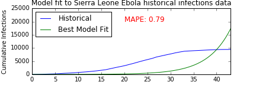
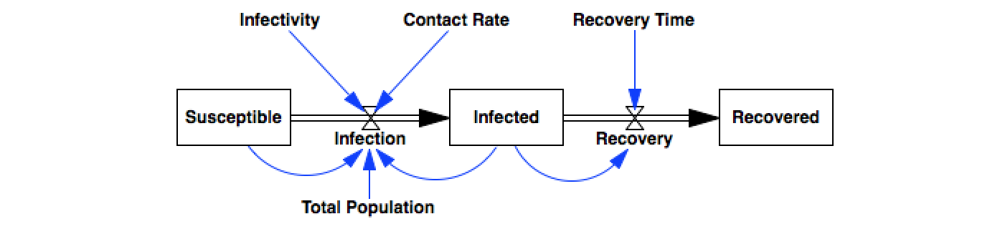

Lessons from software testing for developing behavioral tests of dynamic models
==================
*James Houghton* 
houghton@mit.edu
Proceedings of the 34th International Conference of the System Dynamics Society
*July 2016*

*Abstract:*
*The process of formalizing statements of system behavior with respect to time or as a result of varying parameters has been promoted as a way to build rigor in claims regarding the observable behavior of dynamical systems. In the software development process, formalization of system behavior is commonplace - this is the discipline of Software Testing. This paper builds upon existing system dynamics literature to characterize various types of behavior tests, and then draws on the tools and insights of formal software testing to make suggestions for improving formal testing of system dynamics models.*


## Introduction

The process of formalizing the *structure* of a theory as a simulation model helps to discipline a researcher's effort, forcing her to be explicit in her assumptions and logically consistent in her formulation. The system dynamics tools associated with formalizing structure - stock and flow diagrams, algebraic equations, units of measure, parameter bounds, etc. - are well understood and broadly used by the community.

The process of formalizing statements of system *behavior* with respect to time or as a result of varying parameters has been similarly promoted as a way to build rigor in claims regarding the observable behavior of a system. Despite clear presentation of these concepts by Forrester and Senge (1980) Peterson and Eberlein (1994), and emphasis by Sterman (2000, 2002) they remain underutilized in common system dynamics practice. 

In the software development process, ensuring that software *structure* gives rise to proper *behavior* is commonplace - this is the discipline of Software Testing. The software development field has invested significant resources into developing testing methods and tools, and into structuring the development workflow to include behavior testing as a continuous and ongoing process. 

In this paper I build upon existing system dynamics literature to characterize various types of behavior tests, and then draw on the tools and insights of formal software testing to make suggestions for improving formal testing of system dynamics models.

## Formal behavior testing of dynamic models
While system structure is formalized in a model as a normative declaration of what *is*, the behavior of a system must be formalized as a reflective assessment that simulated behavior corresponds to what it *should be*. More plainly, *behavioral claims are formalized as tests*.

In their publication 'Reality Check: a Bridge Between Systems Thinking and System Dynamics', Peterson and Eberlein (1994) identify five different types of behavioral tests that should be performed to help build confidence in models. Each of these tests involves a procedure for describing the evaluation state of the system, followed by a statement of how we expect the system to behave in this condition. In the following sections I walk through these categories and describe the mechanics of how the behavioral tests they describe are evaluated. I omit discussion of structural tests such as units checks or boundary adequacy tests.

#### 1. Simulation of reference modes
The first category of test evaluates the ability of a model's structure to generate the qualitative shape of the reference modes expected in the underlying system. For example:

> "The population may initially grow exponentially before slowing down and reaching a steady state equilibrium"

> "Growth in grievances may outpace growth in repression, leading to continued protest"

Conducting this test requires simulating the model over a range of values within its parameter space, looking for at least one case in which the reference mode is observed, at which point the test will pass.

#### 2. Consistency with actual data
When evaluating the ability of the model to fit historical data, system dynamicists may use metrics such as the sum of squared errors or mean absolute percent error; along with Theil Statistics (Sterman 1984) that reveal components of error due to bias, variance, and covariance; to provide numerical measures of the ability of the model to replicate historical data. Figure 1 gives an example of a test to ensure consistency between historical data and model simulations.

Evaluation of quality of fit tests requires that the model be fit to data using an optimization procedure designed to best improve the metrics that will be used to evaluate fit quality. When these metrics are calculated, they are then compared against a pre-specified acceptance criterion.

#### 3. Realistic behavior under extreme or limiting conditions
Extreme conditions tests evaluate the implications of setting a value in the model to its maximum or minimum theoretically possible value, to intentionally create conditions which while unlikely to be observed have intuitively understandable consequences. For example:

> "If inventory falls to zero, no shipments can be made"
> "If price becomes infinite, sales must stop"

Evaluation of these tests may be conducted either dynamically by seeing how the model responds over time to exogenous changes in model components, or statically by setting a model component to a particular value and measuring the simultaneous value of a subsequent component.

As these tests are expected to hold in all conditions, we may chose to execute them quickly with a single set of parameter values during development, and then as the model matures, execute them over a range of parameters to ensure robustness to parametric uncertainty.

> "Extreme condition tests provide a critical test of the extent to which models capture underlying physical realities and constraints that affect behavior outside the conditions observed in the past" (Sterman 2000 pg. 871)

#### 4. Conformance to thought experiments
Extreme conditions tests are a special (and easy to identify) case of more general thought experiments system dynamicists may conduct. It is often possible to identify interesting relationships between parameters that lead to predictable behaviors of the system. For example:

> "If the cup of tea is at room temperature, no net heat transfer will take place"
> "If orders continually outpace restocking, inventory must eventually fall to zero"

While these tests do not evaluate the model at extreme conditions, they likewise formalize the modeler's intuition and understanding of the system's behavior as a check against the model's structure. As with extreme conditions tests, these thought experiments can be quickly executed for nominal parameter values during model development, with parametric uncertainty included as the model structure is finalized.

#### 5. Plausible sensitivity to parameter changes over wide ranges
Another category of tests involves running the model a number of times, varying exogenous parameter values, and observing the impact of these changes over an outcome of interest.  For example:

> "All else equal, peak infection rate should be positively correlated with contact frequency"
> "Higher levels of carbon tax implemented in 2020 are associated with greater penetration of solar energy in the year 2050"

To evaluate these tests, we may chose a range of values for the parameter of interest, and through simulation evaluate the resulting outcome of interest, before applying some form of statistical assessment to determine the impact of parameter changes on model output. As these tests by nature require a number of simulation runs to evaluate, they are likely to be run less frequently than some of the preceding types of tests. 

As many of the lessons system dynamics are concerned with concern how systems behave in qualitatively different ways in different areas of the parameter space, tests that inherently look at the changes in behavior due to parametric changes have potential both to reveal new knowledge about the system, and to explicitly encode what has been revealed through model exploration.

## Lessons from software testing
Over the last 40 years, interest in software testing as a methodology has grown continuously. One metric of this growth is that academic publications concerning software *testing* have climbed from five percent of all publications concerning the software development process in 1976 to twenty one percent in 2016 (Web of Knowledge, 2016). There are a number of introductory texts dedicated to the testing process (Myers, Sandler, and Badgett 2012; Patton 2005; Meszaros 2004) and open source resources for developing software testing ability. In the section that follows, I will highlight a number of the best practices for software testing as outlined in these resources, and describe how they relate to the process of dynamic model development.

#### 1. Write tests to last
In the software development world, tests are an asset that may be used throughout a software development lifecycle and across multiple versions of a product, despite changes in the underlying code base. Operating from this mindset, tests should be written carefully so as to have value beyond the immediate case for which they were written.

> "Non-reproducible or ad hoc testing is of little or no use." (Blischke and Murthy 2000)
> "Avoid throwaway test cases unless the program is truly a throwaway program." (Myers, Sandler, and Badgett 2012)

As tests of dynamic models are essentially formalizations of expected system behavior, we expect them to apply even as the underlying structure of the model changes in response to new knowledge. Well written tests are thus likely to outlast the models they are applied to, and form an enduring asset to the modeler. If tests are written to encode the behavior of the underlying system, they should be applicable even to radically different conceptions of system structure. While a modeler should always be ready to abandon a theory in light of a superior alternative, an empirically grounded test will always be relevant.

#### 2. Begin testing early in the development process
Test-driven development is a coding philosophy which asserts that before any code is written, the behavior of that piece of code should be formalized as a test. This process ensures that mistakes are detected early in the development process when they are easy to fix. There is evidence (Jones 2001) that suggests that ensuring code quality through testing can speed up the software development process by limiting rework, even when the time to write tests is taken into account.

> "We need to receive feedback as frequently and as quickly as possible. Good testing strategies shorten the feedback loop, so we can work most effectively" (Goodliffe 2014 pg. 87)

Including tests in the modeling process supports the mindset that models are built in order to learn about the system, not only to write down what is already known. To write tests after having already constructed the model is to say that we don't expect the tests to turn up any mistakes or yield any new learning. Crucially, a modeler should formalize the expected behavior of the model by writing the outcome of the test before actually executing the test. In the alternate scenario - evaluating the model at test conditions before formalizing the expected behavior - it is too easy to convince ourselves that the behavior we see is the behavior we expect.

> "We must design assessment into our work from the start so we can discover errors more quickly" (Sterman 2002)

#### 3. Make tests fast
When tests are written in such a way that they execute quickly, they can be run every time a piece of software or a dynamic model is modified. For tests to be useful during development, they need to run fast enough so as not to interrupt the train of thought of the developer - ideally less than a few seconds. When this is the case, tests can be executed automatically when a model file is saved and the results presented to the user.

> "Slow Tests obviously have a direct cost: They reduce the productivity of the person running the test." (Meszaros 2004 pg. 253)

Tests that are applied to a single time step or a single run in a model are almost always quick to run. When tests require multiple simulations of the model (such as those involved in looking at response to parameter changes) the modeler should be intentional about the tradeoff between thoroughness in parameter space exploration and speed of execution. It is often best to separate testing into two phases, one set of tests which runs quickly and will be executed every time the model structure is changed, and a second set of tests which is more thorough and can be executed periodically.

> "We don’t have to run all the tests all the time! The key is to ensure that all tests are run regularly." (Meszaros 2004 pg. 257)

#### 4. Make tests readable
In addition to the functions that tests provide their author, tests are a also a form of communication. While explicit documentation may fall out of date as software changes (often without any notice), complete and consistently executed tests are guaranteed to be up-to-date examples of how the software works.

> "automated tests act as a form of documentation" (Meszaros 2004 pg. 23)

When formalizing system behavior, communication is even more explicitly a driving purpose for a test. A test of model outputs is itself a rigorous and precise way to describe the behavior we expect to see in the system under examination. Tests of model behavior then must be understandable so that the formal statement they provide can be interpreted by a model consumer. To support this, model tests should also be documented with both a plain-english description of the behavior that is expected in the system, and a precise description of how the test formalizes that behavior.

#### 5. Don't test alone
While writing tests is a crucial part of the development process, tests should also be written by individuals who are not directly involved in coding. Because the programmer is so 'close' to their product, it is easy for them to see what the program *should be* doing, rather than what it *is* doing. Likewise, when a modeler or system expert is intimately engaged in the modeling process, it can be difficult for them to do the mental gymnastics needed to find errors. One way around this is to have competent third parties design tests of the model. 

> "After a programmer has constructively designed and coded a program, it is extremely difficult to suddenly change perspective to look at the program with a destructive eye." (Myers, Sandler, and Badgett 2012 pg. 14)

Third party testers should include both subject matter experts, who through guided facilitation can give information about the expected behavior of the system in various configurations; and also modelers with familiarity in designing behavior tests.


## Testing mechanics
In the preceding description, behavioral tests were categorized according to their purpose. These same tests can also be categorized according to the logical form they take when implemented: some tests must pass under all parameter conditions, others must pass under at least one set of parameters, and some require a variety of parameter values to operate. 

The first of these categories can be readily evaluated with Vensim's built in 'Reality Check' functionality. As the second and third category require some specification of the parameter space over which the model must be evaluated, I will use Python's standard data science libraries to construct and run these more detailed tests. Models will be simulated using PySD (Houghton 2015), a tool for translating system dynamics models from standard modeling software into python for simulation. As a demonstration case, the next section will apply the lessons described above to the process of modeling an epidemic. 

#### 1. Simulation of reference modes
Following the imperative to begin testing early in the process, the first step will be to construct a test of the expected behavior modes. For example, in an epidemic the initial phase of propagation will be characterized by growth at an increasing rate. When we formalize this, we say that the first and second derivatives of the value of the infected population will initially be greater than zero. Formalized as a test, this becomes:

```python
def test_initial_growth(result):
    """ Ensure that the initial values of the first and second 
    derivative of the infected population are both positive """
    first_deriv = result['Infected'].diff()
    second_deriv = first_deriv.diff()
    if first_deriv.dropna().iloc[0] > 0 and second_deriv.dropna().iloc[0] > 0:
        return True
```
This function expects to be passed a Pandas DataFrame containing the result of a simulation, containing at least a column representing the Infected population. It takes advantage of the finite difference function `diff` to approximate first and second derivatives of the result, and then checks to see that the first values of these are both positive. 

Tests may also be written to evaluate reference modes in which the infected population returns to zero given enough time, or that all or only a fraction of the population will suffer from the disease.

Having written tests of behavior modes, the modeling process begins. The simplest model of disease propagation may be a two-stock 'Susceptible-Infected' model:


PySD is used to import and run the model, after which the test function can be applied to the model's output:

```python
model = pysd.read_vensim('SI.mdl')
result = model.run()
test_initial_growth(result)
```
It is clear that there are cases in which this test would not pass - for instance, if the Initial Infected population were zero. The reference mode test, however, only asks that the model be capable of generating the expected behavior in at least part of its parameter space. The following function can execute the test over a range of parameter values, looking for at least one in which the test returns a `True` value.

```python
def any_condition(conditions, test):
    for condition in conditions:
        result = model.run(params=condition)
        if test(result):
            return True
    return False            
```
When this function is called with a list of possible model conditions, this general behavior mode test passes: 

```python
conditions = [{'Initial Infected': 0},
              {'Initial Infected': 1},
              {'Initial Infected': 2},
              {'Initial Infected': 3}]

print any_condition(conditions, test_initial_growth)
```
> `True`

Going into more detail, the first run of the `test_initial_growth` function with a zero value for the Initial Infected population returned a `False` value. The second run, with Initial Infected population of 1 returned a `True` value, and the test finished returning a `True` value overall.

#### 2. Consistency with actual data
Having passed a behavior mode test, the model can be subjected to a test of its ability to replicate observed historical behavior. In this test, that data will be cumulative reported cases of Ebola in Sierra Leone since the start of the epidemic in 2014, from the World Health Organization (2015). 

```python
data = pd.read_csv('Ebola_in_SL_Data.csv', index_col='Weeks')
```

To test the ability of the model recreate historical data, the model must be fit to the data through some form of optimization. In the SI model, the degrees of freedom include the Total Population and the Initial Infected population, which are known from census data and from WHO data, the Contact Frequency and the disease Infectivity. These last two parameters work together to influence the infection rate, and so can be treated essentially as a single variable.

The fitting process will then be to adjust the Contact Frequency to minimize the Mean Absolute Percent Error (MAPE) between the data and the model's predictions. If the optimizer is able to reduce the MAPE below a specified threshold (here we use 50%, merely for the sake of demonstration) then the test will pass.

The test function below takes as parameters the data and a threshold for the MAPE. It sets known parameters in the model, and then uses the SciPy Optimization library to fit the model to the data, and evaluates if the final MAPE is below the test threshold.

```python
import scipy.optimize as opt

def test_data_fit(data, max_mape):
    model.set_components({'Total Population':5200000.0,
                          'Initial Infected':3.0})

    def mape_error(param_list):
        result = model.run({'Contact Rate': param_list[0]})
        return (abs((result - data)/data)).mean()['Cumulative Cases']

    res = opt.minimize(mape_error, 10, method='L-BFGS-B', bounds=[(0,100)])
    return res.fun < max_mape

print test_data_fit(data, max_mape=0.5)
```
> `False`

This test of the model's ability to replicate the data fails, and it is not difficult to see why. A model which omits 'recovery' can only come to equilibrium when all of the population has been infected. The data, however, indicates that there are very few new infections after about 35 weeks. At this point the simulated result is still growing exponentially.



The tests presented so far follow the first lesson from software testing described above, in that they were written to last. Having been coded once, they can be easily applied or extended to handle models including 'Recovery'.


#### 3. Realistic behavior under extreme or limiting conditions
To test extreme values of elements of the expanded SIR model, it is important to identify which elements to vary, and which elements to measure. Clearly elements with no causal influence (such as the 'Recovered' population) do not need to be varied. Likewise, there is no sense in measuring the value of stocks, as they will vary depending on their existing state. (While an argument could be made that if the Susceptible and Infected populations were both zero, the Recovered population would need to be equal to the Total Population. However, this is a conservation constraint, not a product of the direct logic of the model.)

For all tractable conditions, a table can be constructed mapping various extreme conditions to their influence on downstream components. In this table, the first two columns define a condition, and the last two columns define the influence of that condition on Infection and Recovery rates. In some cases there is no obvious influence, and these are marked with a dash. This structure of testing conforms to the imperative to 'make tests readable'. The table below serves both as a set of tests and as communication of the expected behavior.

|                  | **Value** | Infection | Recovery |
| ---------------: | :---      | :-------: | :------: | 
| Susceptible      | **0**     | 0         | -        |
| Total Population | **0**     | 0         | 0        | 
| Infected         | **0**     | 0         | 0        |
| Contact Rate     | **0**     | 0         | -        |
| Recovery Time    | **inf**   | -         | 0        |
| Infectivity      | **0**     | 0         | -        |

If this table is expressed in an excel file, the following lines of code can test all of the extreme conditions. The code first loads a clean model, then sets the model parameters according to the first two columns of the table. The model values are compared to their corresponding table values, and discrepancies are noted. If the process results in an error, that error itself is logged.

```python
tests = pd.read_excel('SIR_Extreme_Conditions.xlsx', index_col=[0, 1])
errors = []
for index, row in tests.iterrows(): 
    try:
        model = pysd.read_vensim('SIR.mdl')
        result = model.run(params=dict([index]), 
                           return_columns=row.index.values, 
                           return_timestamps=0).loc[0]
        
        for key, value in row.iteritems():
            if value != '-' and result[key] != value:
                errors.append('When %s = %s, %s is %s instead of %s' % 
                              (index[0], index[1], key, result[key], value))
                
    except Exception as e:
        errors.append('When %s = %s, %s' % (index[0], index[1], e))
        
print errors
```
> `['When Total Population = 0.0, float division by zero']`

For the SIR model, when Total Population is set to zero, the model exhibits a divide by zero error. We correct this by modifying the equation for Infection to use the `ZIDZ` (zero if divide by zero) function. The remaining tests pass.

#### 4. Conformance to thought experiments
Thought experiments build on the concept of extreme conditions tests to ensure that the model behaves according to expectations at parameter values other than the limits of the various variables. In the SIR model, when only a small fraction of the population is infected, we expect the number of people infected to grow if the product of the Contact Rate and the Infectivity is greater than the recovery rate, or 1/Recovery Time. This can be formalized with the following test, which compares an expected result based upon the conditions of the test with the simulated result.

```python
def test_reproduction_rate():
    result = model.run(return_columns=['Contact Rate', 'Infectivity', 
                                       'Recovery Time', 'Infected'])
    growth_expected = (result['Contact Rate'].iloc[0] * result['Infectivity'].iloc[0] > 
                       1./result['Recovery Time'].iloc[0])
    growth_observed = result['Infected'].diff().dropna().iloc[0] >= 0
    return growth_expected == growth_observed
```

This test should pass under all parameter conditions. The following helper function ensures that this is the case:

```python
def all_conditions(conditions, test):
    for condition in conditions:
        model.set_components(condition)
        if not test():
            print condition
            return False
    return True
```

The following describes the structure that would be used for a more thorough exploration of the parameter space:

```python
conditions = [{'Initial Infected':i} for i in range(4)]
print all_conditions(conditions, test_reproduction_rate)
```
> `True`

#### 5. Plausible sensitivity to parameter changes over wide ranges
As parameters in the model are varied, elements of the model may respond in predictable ways that can be formalized as tests. For example, in the SIR model, as the contact frequency increases the peak number of new infections should also increase. The code below calculates the peak value of the 'Infection' flow for a range of values of Contact Frequency. The expected relationship is then formalized a test of the correlation between the parameter and the model outcome.

```python
from scipy import stats
def test_contact_rate_peak_infectivity_correlation(correlation_threshold):
    contact_rates = range(0, 100, 3)
    peak_infectivity = [model.run({'Contact Rate': cr},
                                  return_columns=['Infection']).max()['Infection']
                        for cr in contact_rates]
    
    r, p = stats.pearsonr(contact_rates, peak_infectivity)
    return r > correlation_threshold and p < .05
    
print test_contact_rate_peak_infectivity_correlation(.5)
```
> `True`

For rigor, this type of test should also be conducted varying the values of the remaining model parameters. Additional tests could look for the nonlinearity in the total number of infections as the reproduction rate of the disease becomes greater than one with increasing Contact Frequency, etc.

## Discussion
In 'The Art of Software Testing', Myers, Sandler, and Badgett show that 'it is impossible to develop a program that is completely error-free.' Testing, however, is used to build confidence that the software achieves its purpose and delivers utility to the user in a reliable way. (Myers, Sandler, Badgett 2012)

> "No test is perfect, but the existence of tests serves to increase confidence in the code you write, and in the code you maintain." (Goodliffe 2014 pg. 99)

Likewise, in the field of modeling George Box gave us the aphorism that 'all models are wrong'. Behavioral testing is one way to articulate the ways in which we expect a model to be useful, and build confidence that in these ways the model is consistent with our expectations. 

The purpose of explicit behavioral testing in software development has many parallels to the purpose of behavioral testing in dynamic modeling:

| Software Development                     | Dynamic Modeling                            | 
| ---------------------------------------- | ------------------------------------------- | 
| Make expected behavior of code explicit  | Make statements of system behavior explicit |
| Make developing software easier          | Help with model formulation                 |
| Ensure robustness to unknown user input  | Ensure robustness to uncertain parameters   | 
| Support code acceptance by client        | Create defensible statements of behavior    |


#### Tests facilitate collaboration

Behavioral tests are used extensively by software developers to facilitate collaboration. Especially in the open source community, where contributions can come from unknown sources and where derivative works are common, the presence of a comprehensive test suite gives developers confidence that in modifying or extending the work of others, they are not introducing errors that have been previously addressed by the original authors. These tests then give the original authors confidence to incorporate changes into a master branch of the software. 

This pattern, in which the important behavior of a model is specified through tests, has the potential to facilitate collaboration in model development and exploration. Firstly, by encoding empirical behavior observations as tests, models can be extended with confidence that they are consistent with the original modeler's understanding of the system. Secondly, by encoding the lessons drawn from simulation into behavioral tests, modelers and their collaborators will have a straightforward way to discover if these lessons are robust to changes in parametric or structural assumptions. 

#### Testing supports learning

Behavioral tests are a useful tool for rapidly coming to understand software developed by other researchers. The process of reading tests written by software developers reveals how those developers expected the program to behave, and the process of writing tests for other developers software provides a structure for understanding how that software works. Likewise, constructing tests of established theory is a disciplined way to understand the details, extent, and limitations of that theory.  

Proper attention to software testing improves not only the program, but the programmer. The best programmers write good tests, and the causality goes both ways: good testing builds a programmer's skill. Likewise, writing behavioral tests of system dynamics models in parallel to the effort of developing models can give fast feedback to the modeler about her method of model development. This feedback serves to reinforce modeling best practices by demonstrating in real time to the modeler why they are established as best practices in the first place.

#### Testing supports the generation of new knowledge

Because 'all models are wrong', behavioral tests of models will never be complete or perfectly specified. While incomplete tests are a limitation for software developers, for researchers they provide an opportunity. By adding new tests to existing formalized theory, researchers may identify gaps in existing knowledge and assess the gaps' importance for the theory's implications. When new theories are developed, they can readily be assessed against existing theories by subjecting formal representations of each theory to the same set of tests.

Tests can also serve as prototypes for experiments designed to distinguish between competing theories. Any experiment to be performed in the real world can first be formalized as a behavioral test, and then conducted in simulation to build confidence in the experimental design.

#### Further developments in testing dynamic models

There are a number of innovations in the field of software engineering that have potential to improve the process of dynamic modeling, but will require translation across domains. 

The first is the concept of 'coverage'. For software developers, this term implies the extent to which a set of tests is able to exercise a program's code. A test suite that exercises only 50% of a program's lines of code is judged to be inferior to one that exercises 90%. This is an imperfect metric, as merely executing a line of code is not the same as ensuring that it is adequately tested. Having a simple metric is useful in the development process, however, as it can highlight areas for the focussed development of tests. 

In dynamic models, it is almost always the case that a single run of the simulation will exercise all model components. The concept of 'coverage' must then be translated by identifying a standard set of tests (for example, extreme conditions tests) whose presence or absence can be measured and aggregated.

A second innovation from the software development field that could be applied to system dynamic models involves automatic test suggestion. Going beyond extreme conditions tests, model simulation can reveal situations in the state space in which a test might be useful. For example a comparison of when stock elements with common units change in a ranking of magnitude could suggest that a test be written to look for a change in behavior when the cost of electricity from coal exceeds the cost of electricity from solar. 


## Conclusion
Many of the benefits of testing that have been realized, developed and capitalized upon by the software development community have yet to be incorporated into the standard dynamic modeling process. This paper highlights some of these lessons, and demonstrates the use of some tools which may be of use to system dynamics practitioners hoping to improve the testing of their models. There are many other models and tools which have the potential to make an impact in this field, some in the resources referenced here, and others elsewhere.

## Authors Note
For access to the models and analysis scripts used in the preparation of this paper, see https://github.com/JamesPHoughton/model-behavior-testing.

## References
Blischke, W. and D. Murthy. 2000. Reliability: Modeling, Prediction, and Optimization. Wiley-Interscience. 

Forrester, Jay W. and Peter M. Senge. 1980. “Tests for Building Confidence in System Dynamics Models.” Pp. 209–28 in Modelling for Management II. North-Holland Publishing Company.

Goodliffe, Pete. 2014. Becoming a Better Programmer: A Handbook for People Who Care About Code. First Edit. Sebastopol, CA: O’Reilly Media.

Houghton, James and Michael Siegel. 2015. “Advanced Data Analytics for System Dynamics Models Using PySD.” in Proceedings of the 33rd International Conference of the System Dynamics Society.

Jones, Capers. Applied Software Measurement: Assuring Productivity and Quality. New York: McGraw-Hill, 1991

Meszaros, Gerard. 2004. xUnit Test Patterns. Upper Saddle River, NJ: Addison-Wesley.

Myers, Glenford J., Corey Sandler, and Tom Badgett. 2012. The Art of Software Testing. Third Edition. Wiley.

Patton, Ron. 2005. Software Testing. Sams Publishing.

Peterson, David W. and Robert L. Eberlein. 1994. “Reality Check: A Bridge between Systems Thinking and System Dynamics.” System Dynamics Review 10(2-3):159–74.

Sterman, John D. 2000. Business Dynamics. Boston: Irwin McGraw-Hill.

Sterman, John D. 2002. “All Models Are Wrong: Reflections on Becoming a Systems Scientist.” System Dynamics Review 18(4):501–31.

Web of Knowledge Citation Analysis. Data drawn August 2016. www.webofknowledge.com 

World Health Organization. 2015. Reported cases of Ebola in Sierra Leone. http://apps.who.int/gho/data/view.ebola-sitrep.ebola-country-SLE-20150422-graph?lang=en